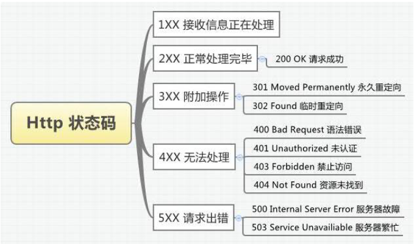

#node二0528
[toc]
##Buffer--16进制的
特点：**读取的内容是二进制的，展现形式是16进制**

###什么是buffer？
缓冲区buffer是暂时存放输入输出数据的一段内存。
JS语言没有二进制数据类型，而在处理TCP和文件流的时候，必须要处理二进制数据。
NodeJs提供了一个Buffer对象来提供对二进制数据的操作
是一个表示固定内存分配的全局对象，也就是说要放到缓存区中的字节数需要提前确定
Buffer好比由一个多位字节元素组成的数组，可以有效的在javascript中表示二进制数据

###字节和位
1个字节有 8个位，一个gbk汉字相当于2字节，但是，node只支持utf-8格式，一个汉字3个字节。
每个位存放的都是二进制
公式：**当前位的最大值*2^（当前位-1）进行累加**
一个字节在十进制中最大是255，16进制全部以0x开头。8进制以0 x开头

10进制转化成16进制

##buffer特点
- 长度固定

##buffer 定义方式
- 1.通过长度定义，内容是随机的，但是每一项都不会超过ff
```
var buffer=new Buffer(6);
buffer.fill(0);//清空内存,手动填充buffer
buffer.fill(0,3,5);//3个参数
console.log(buffer);//<Buffer 00 00 00 00 00 00>
```
####buffer.fill
将制定数据填充到buffer中。
`buffer.fill(value,[offset],[end])`
接收参数
value  将要填充的数据
offset  填充数据的开始位置，不指定默认为0
end     填充数据的结束位置，不指定默认为buffer的长度

- 2.通过数组定义
```
var buffer=new Buffer([100,120,140]);
var buffer=new Buffer(['adfsdfs',120,140]);//<Buffer 00 78 8c>//如果数组中的某一个不能正确转化，则是0;如果超过255，则对256取模；如果写的是负数，则加上256
console.log(buffer);//<Buffer 64 78 8c>
```
- 3.通过字符串创建
将buffer转化成字符串方法：toString()
```
var buffer=new Buffer('珠峰培训');
console.log(buffer);//<Buffer e7 8f a0 e5 b3 b0 e5 9f b9 e8 ae ad>
console.log(buffer.toString());//将buffer转换成字符串，方法是toString()
console.log(buffer.length);//字节的长度
console.log(buffer[0]);//有索引，取buffer中的某一个，则是16进制代表的10进制
//通过汉字创建的buffer内容和汉字是对应的
```

##buffer方法
1.`buffer.toString([encoding],[start],[end])`：将buffer对象转换成指定的字符编码的字符串.encoding 转换成字符串后的字符编码，默认为utf8;   ’start‘：buffer转换的起始位置，默认为0；’end‘： buffer转换的结束位置，默认为buffer长度
2.buffer.length
3.slice 截取，包前不包后
4.copy


###浅拷贝与深拷贝
#####浅拷贝 
拷贝的是栈空间内存地址，并不是拷贝的内容；比如，对于数组的拷贝
```
var arr=['北京','上海','广州','深圳','成都'];
var newArr=arr;
newArr[3]='杭州';
console.log(arr);//0:'北京'1:'上海'2：'广州'3:'杭州'4：'成都'
console.log(newArr);//0:'北京'1:'上海'2：'广州'3:'杭州'4：'成都'
```
#####深拷贝
对于数组深拷贝的方法
1.用数组的slice方法进行拷贝
`arrayObj.slice(starIndex,endIndex)`
参数说明：arrayObj--必填项，是需要从该数组中来截取数组；starInex--必填项，表示截取开始的位子的下标；endIndex--选填项，如果该项不填，则从开始位置截取到最后，如果starindex或endinex为负数，那么从结尾开始计数下标。
2.用concat方法，该方法不会改变原有数组，会返回连接后数组的副本，Arrayobj.concat(arrat1,array2,array3,...)，该方法会将数组中的元素取出，放入一个新数组中，返回改数组。
```
var arr=[1,2,3,4];
var arr1=["北京","上海"];
var newArr=arr.concat(arr1);
console.log("原数组:"+arr);
console.log("新数组:"+newArr)
 //返回结果
//原数组:1,2,3,4
//新数组:1,2,3,4,北京,上海
```

####如何拷贝一个对象
- 1.递归循环
`var obj={name:1,age:2,a:function(){}}`
- 2.stringify方法
```
var obj={name:1,age:2}
var obj2=JSON.parse(JSON.stringify(obj))//stringify不识别函数
console.log(obj2);//{name:1,age:2}
console.log(obj2===obj);//false
```
- 3.es6方法 Object.assign()
```
var obj={name:1,age:2,a:function(){}};
var obj1={};
Object.assign(obj1,obj);
Object.assign(obj1,obj,{age:3});//{ name: 1, age: 3, a: [Function: a] }会把之前的覆盖掉
```
>buffer 中存的也是内存地址，可以将buffer看成一个二维数组。

- 4.copy,可以将小的buffer拷贝到大的buffer上
```
var buffer=new Buffer(12);
var buf1=new Buffer('珠峰');
var buf2=new Buffer('培训');
//targetBuffer   targetStart   sourceStart  sourceEnd
buf2.copy(buffer,0,0,buf2.length);
buf1.copy(buffer,buf2.length,0,buf1.length);
console.log(buffer.toString());//培训珠峰
```
- 5.Buffer.concat([buf1,buf2]);返回的还是buffer
```
var buf1=new Buffer('珠峰');
var buf2=new Buffer('培训');
//如果不写长度，默认是拼接后的长度，如果写的过长，多余的要截取掉。长度过小，则拷贝不进去
console.log(Buffer.concat([buf1, buf2], 1000).toString());//培训珠峰
console.log(Buffer.concat([buf1, buf2], 3).toString());//珠
```

###reduce方法
`arr.reduce(callback[, initialValue])`
####forEach实现
```
var arr = [1,2,3,4],
sum = 0;
arr.forEach(function(e){sum += e;}); // sum = 10  just for demo
```
####map实现
```
var arr = [1,2,3,4],
sum = 0;
arr.map(function(obj){sum += obj});//return undefined array. sum = 10  just for demo
```
####reduce实现
```
var arr = [1,2,3,4];
arr.reduce(function(pre,cur){return pre + cur}); // return 10
```
####总结
>forEach 方法是将数组中的每一个值取出做一些程序员想让他们做的事情
>map 方法 是将数组中的每一个值放入一个方法中做一些程序员想让他们做的事情后返回一个新的数组
>reduce 方法 将数组中的每一个值与前面的被返回相加的总和(初始值为数组的第一个值或者initialValue)

##进制转化
###将任意进制转化成10进制 parseInt
`console.log(parseInt('0011111',2))`//参数：需要转化的内容，当前内容的进制
###将任意进制转换成任意进制 toString
`console.log(0xff.toString(2))`
###base64转换  将汉字转换成base64,没有加密功能
md5加密：是指 不可逆，不能解密；加密的结果的长度都是一样的；不同内容加密后的结果不一致
```
let buffer=new ArrayBuffer('珠');
console.log(buffer);//e7 8f a0
console.log(0xe7.toString(2));
console.log(0x8f.toString(2));
console.log(0xa0.toString(2));
// 111001 111000 111110 100000  拆分成6个一位
console.log(parseInt('111001', 2));//57
console.log(parseInt('111000', 2));//56
console.log(parseInt('111110 ', 2));//62
console.log(parseInt('100000', 2));//32
let str='ABCDEFGHIGKLMNOPQRSTUVWXYZ';
str+=str.toLowerCase();
str+='0123456789';
str+='+/';
console.log(str[57]+str[56]+str[62]+str[32]);
```
##fs
fs里面的方法都是同步和异步同时出现的，能用异步的话尽量不用同步

###读取文件
特点：
1）读取的文件必须存在
2）读出的类型默认是buffer	
3）/代表的是根目录，当前文件所在的磁盘的根目录
4）同步的结果永远都在返回值上，异步的结果在callback参数中
####同步
```
let school={};
 let name=fs.readFileSync('./name.txt','utf8');
 school.name=name;
 let age=fs.readFileSync('./age.txt','utf8');
 school.age=age;
 console.log(school);
```
####异步
很多时候处理异步 可以进行嵌套，可能会导致回调地狱(promise)
```
let school = {};
fs.readFile('./name.txt', 'utf8', function (err, data) {
	if (err) {
		console.log(err);
	}
	school.name=data;
	//把这个readFile放在里面
	fs.readFile('./age.txt', 'utf8', function (err, data) {
		if(err){
			console.log(err);
		}
		school.age=data;
		console.log(school);
	});
});
```
####Object.keys()
在实际开发中，我们有时需要知道对象的所有属性，原生js给我们提供了一个很好的方法：Object.keys()，该方法返回一个数组
```
var obj = {'a':'123','b':'345'};
console.log(Object.keys(obj));  //['a','b']
```

###promise()
有3个方法：resolve,成功回调；reject,失败的回调；all,
```
function readName() {
	return new Promise(function (resolve, reject) {
		fs.readFile('./name.txt', 'utf8', function (err, data) {
			if (err) reject(err);
			resolve(data);
		})
	});
}
```
######了解
```
readName().then(function(){
	成功的回调；
	console.log(data);
}).catch(function(){
	失败的回调
})
```

```
//es6语法，想要在obj里输出{b:1}
let a = 'b';
let obj = {
	[a]: 1//套上[]，a就变成变量了
};
console.log(obj);//{b:1}
```

###all重要
```
Promise.all([readName(), readAge()]).then(function (result) {
	console.log(result);//顺序问题跟 all里数组的顺序是一致的
	school.name=result[0];
	school.age=result[1];
	console.log(school);
});
```

###写入文件
特点：
1）写入的内容会自动转换成utf-8格式，
2）flag:'w'   清空、创建、读写
3）如果写入的是对象，需要用JSON.stringify
```
fs.writeFileSync('./age.txt');//第二个参数不传，age.txt里是undefined
fs.writeFileSync('./age.txt',JSON.stringify({name:1}));//不写JSON，是[object,object]
```
>readFile不能读取比内存大的文件（不大于64k），太大会导致淹没可用内存。流（边读边写）

###mkdir
必须在父级有的情况下创建子级
`fs.mkdirSync('a/b');//报错，没有a不能创建b`
```
let fs = require('fs');
function makep(url) {
	let urlArr = url.split('/');//[a,b,c,d]
	for (let i = 0; i < urlArr.length; i++) {
		let curPath = urlArr.slice(0, i + 1).join('/');
		if (!fs.existsSync(curPath)) {//判断文件是否中存在，存在的话不创建
			fs.mkdirSync(curPath);
		}else{
			console.log('已经存在了~~');
		}
	}
}
makep('a/b/c/d');
```
###path
####path.resolve()
解析，把相对路径解析为绝对路径
```
console.log(path.resolve('age'));
console.log(path.resolve('age', '..'));
```
####path.join()
连接
```
console.log(path.join('dist', 'a', 'b'));
console.log(path.join(__dirname, 'dist', 'a', 'b'));//加上__dirname就和resolve一样了
```
###stream(流)基于事件的
流（stream）在 Node.js 中是处理流数据的抽象接口（abstract interface）。 stream 模块提供了基础的 API 。使用这些 API 可以很容易地来构建实现流接口的对象 Node.js 提供了多种流对象。 例如， HTTP 请求 和 process.stdout 就都是流的实例。 流可以是可读的、可写的，或是可读写的。所有的流都是 EventEmitter 的实例。

Node中用fs模块的createReadStream和createWriteStream分别创建可读流和可写流

####可读流
createReadStream 这个方法继承了events类，因而也可以发射和监听相关事件
异步，可以控制速率
创建一个可读流
```
//1.创建一个可读流
let fs = require('fs');
//特点
//1、highWaterMark  64k每次读取大小
//2、没有编码默认是buffer格式。
let rs = fs.createReadStream('name.txt', {highWaterMark: 1});

//读取可读流中的内容，非流动模式->流动模式
let str = [];
rs.on('data', function (data) {//监听每次读到的内容
	rs.pause();//暂停读取，暂停触发data事件
	console.log('读取一次');
	str.push(data);
});
setInterval(function () {
	rs.resume();//恢复触发data事件
}, 2000);
rs.on('end', function () {//文件读取完成后 执行end方法
	console.log(Buffer.concat(str).toString());
//	buffer可以控制速率
});
rs.on('error', function (err) {//监听读流中的错误
	console.log(err)
	;
});
```
options是一组key-value值，常用的设置如下：
flags: 对文件进行何种操作，默认为'r'，读文件
encoding:指定编码，默认为null,如果不设置具体的编码格式，读出的数据就是Buffer类型；也可以使用rs.setEncoding("utf-8")指定编码格式
start:从start开始读取文件
end:读取文件到end为止(包括end)
highWaterMark:最高水位线，内部缓冲区最多能容纳的字节数，如果超过这个大小，就停止读取资源文件，默认值是64KB
highWaterMark 比如有一个100KB的文件，设置highWaterMark为10KB,那么系统会先从资源文件中读取出10KB的数据，再触发data事件;然后再读取10KB的数据，触发data事件，不断执行，直到读出了所有的数据，触发end事件。highWaterMark不能设置的过小，过小就会频繁的操作文件，影响性能。
可读流还有两个重要的方法：pause和resume，分别可以禁止发射data事件以及激活发射data事件。
####x写入流
特点
如果文件不存在，则创建
写入时默认编码是utf8格式
通过流写入文件也是异步
默认写的时候创建的空间大小时16k

//写入0-9
```
let fs=require('fs');
let ws=fs.createWriteStream('./2.txt',{highWaterMark:1});
for(let i=0;i<10;i++){
let flag=ws.write(i+'')}//把数字当做字符串传入进去
}
ws.end('撑死我了')；//end方法会调用write方法，无论是否写完，都会被强制写入，关闭掉文件
ws.end('撑死我了')；//报错 write after end 已经结束了，不能再写入了。所以end方法只能调用一次！！！
```
其常用的options值为：  
flags:对文件进行何种操作，默认为“w",代表写文件；如果是"a"，代表每次写入的时候，不清空文件中的原有数据，而是直接在原有数据的末尾添加新数据
encoding:指定写入的编码格式，默认为null
start:文件开始写入的位置
highWaterMark:缓存区能够容纳的最大字节数，默认为16KB，如果超过这个值，write方法就会返回false 可写流的highWaterMark也代表了缓冲区的容量，如果缓冲区已经装满了，继续写入数据就会失败。只有等缓冲区里的内容被写入文件后，才可以重新调用write方法写入下一个highWaterMark大小的数据（data chunk)。 可写流也有两个重要的方法：write和end,write定义了写入的内容，end可以将还未写入的内容强行写入文件，并且关闭目标文件（不能继续写入了）。
###总结
####fs
- 读取文件
	- readFile，事件发射，
	`Promise.all([p1,p2]).then(function([p1,p2]){})`
	- readFileSync
>将内容全部读取到内存中

- 写入文件
- 
	-  writeFile
	- writeFileSync
- fs.mkdir
- fs.mkdirSync
- path.resolve
- path.join

###events
- on 
- emit
- removeListener
- once
- removeAllListener
五个方法： on('data') on('end') on('error') pause resume

###流
概念：流是一组有序的 有起点和终点的字节数据传输手段。不关心文件的整体内容，值关注是否从文件中读到了数据，以及读到数据之后的处理。
ws.end('C')//写入并结束

###复习
可读流方法  on('data')   on('end')   on('error')   pause  resume  64k  疯狂的读取数据

可写流方法 write  end  on('drain')  16k

边读边写
拷贝，先读一次，rs.on('data')开始写，ws.write(),如果不能写了，rs.pause();当数据全部写入后ws.on('drain'),恢复读取rs.resume();监听读取完成的end事件，rs.on('end');调用写入的关闭事件ws.end();

##http
####客户端
能想特定IP的特定端口发起请求并接受响应的
####服务器
能在特定IP的特定端口上监听客户端的请求，并根据请求的路径返回相应结果

```
let fs = require('fs');
let http = require('http');
let mime = require('mime');
let url=require('url');
http.createServer(function (req, res) {
	let {pathname,query} = url.parse(req.url,true);
	//req.url是带有查询参数的，我们需要的是路径
	if (pathname === '/') {
		res.setHeader('Content-Type', 'text/html;charset=utf-8');
		fs.createReadStream('./index.html').pipe(res);
	} else if(pathname==='/clock'){
		let time=new Date().toLocaleString();
		res.end(JSON.stringify({time,error:0}));
	}else {
		//	mime是一个可以根据后缀 推算出对应的content-type类型，'/index.css'=>'text/css'
		//先要判断文件是否存在
		fs.exists('.' + pathname, function (flag) {
			console.log(pathname);//  /clock
			if (flag) {
				res.setHeader('Content-Type', mime.lookup(pathname) + ';charset=utf-8');
				fs.createReadStream('.' + pathname).pipe(res);
			} else {
				res.statusCode = 404;
				res.end('NOT FOUND');
			}
		})
	}
}).listen(3000, function () {
	console.log('server start 3000');
});
```

###请求方式
####GET
GET方法用来请求访问URL所指定的资源，（我想访问你的某个资源）并不对服务器上的内容产生任何作用结果；每次GET的内容都是相同的。GET请求所需要的参数放到URL中，直接就可以在URL中看见，有大小限制

####POST
POST方法用来传输实体主体，目的并不是获取响应的主体内容，（我要把这条信息告诉你），POST方式则是把内容放在报文内容中，因此只要报文的内容没有限制，它的大小就没有限制。
>总结：GET用于获取某个内容，POST用于提交某种数据请求。按照使用场景来说，一般用户注册的内容属于私密的，这应该使用POST，而针对某一内容的查询，为了快速的响应，可以使用GET方式

###其他常用方法
|方法|用法|
|:--:|:--:|
|GET|向服务器获取资源|
|POST|向服务器发送数据|
|DELETE|从服务器上删除资源|
|HEAD|仅向服务器获取响应头，不要响应体|
|PUT|更新服务器上的一个资源|
|OPTIONS|获取服务器上可以支持的方法|

####Http状态码


####查询字符串
>var queryObj = querystring.parse(str,[sep],[eq]); //字符串转对象
var queryStr = querystring.stringify(obj,[sep],[eq]); //对象转字符串
str 需要被转换的查询字符串
sep 查询字符串中的分割字符,默认为&
eq 查询字符串中的分配字符，默认参数值为=

###Promise
所谓Promise，简单说就是一个容器，里面保存着某个未来才会结束的事件（通常是一个异步操作）的结果。从语法上说，Promise 是一个对象，从它可以获取异步操作的消息。


